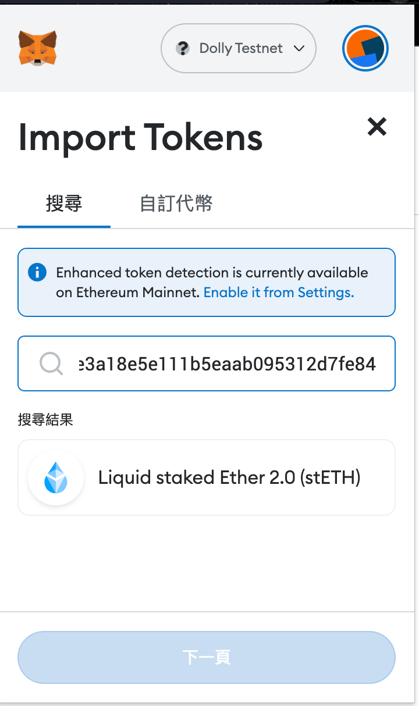

# Defi-Dolly
> AppWorks Final Project

> LSD（Liquid Staking Derivatives，流動性質押衍生品）

## TL;DR
### 功能
- Stake ETH or stETH (build tenfold leverage)
- Unstake (to claim reward)
### 涉及協議
- Lido
- Balancer
- Compound V3
- Uniswap V3

## Description
### Pain Point
  一般用戶要透過循環借貸，擴大 Staking 的收益，會面臨三個門檻：
  #### 流程繁雜：要在各個協議之間串來串去
  ex. `在 Lido 質押 ETH、得到 wstETH` → `在 Compound 抵押 wstETH、得到 ETH` → (repeat…)
  #### gas fee 高
  ex. Compound 上，wstETH 的 collateral factor 是 90%
  若用戶自行手動操作，也要交易將近 30 次，才能將帳面資產擴大到接近理想槓桿目標
  
  (以下為：操作上述流程 30 次後，加總所有帳面資產 & 帳面借貸(是一個無窮等比級數和))

  |  | 資產 | 債務 |
  | --- | --- | --- |
  | 理想槓桿目標 | 10 | 9 |
  | 交易30次後 | 9.576088417 |  8.618479576 |
    
  #### 無法達到理想槓桿目標
  用上述方案，永遠無法實現理想槓桿目標，只能無窮逼近，等於浪費槓桿空間

### Gaol
- 建立一個平台，協助用戶用最低成本擴增帳面資產，實現理想槓桿目標
- 用戶質押 ETH or stETH 到平台，平台可以將其放大到數倍的帳面資產，以獲取更多質押獎勵。
  - 例如：`UserAsset` = 1 ETH
  - 目標：放大帳面資產 = `UserAsset1 * {1 + [CF / (1 - CF)]}`
      
      = 1 * 1 + ( 90% / 10% ) = 10 ETH

### Solution
  - Lido + FlashLoan + Compound

(以下本專案，稱 Hub)

#### Stake Flow

- Hub 的倉位資訊

| 債務 | 帳面資產 | 實際資產 |
| --- | --- | --- |
| 用戶的 1 ETH & Compound 借貸的 9 ETH | 在 Compound 抵押的 wstETH(等值 10ETH ) | 0 |

#### Unstake Flow

- 用戶 Stake 1 ETH，經過兩天

- Compound V3

| 抵押 | 債務(含借款利息) |
| --- | --- |
| 8.9008 wstETH | 9.00164 ETH |

- 用戶資產

| 本金+收益 | 債務(含借款利息) |
| --- | --- |
| 1 stETH + 0.0027 stETH | 9.00164 ETH |

## Framework
- Proxy Contract: `Transparent`
- Imple Contract: `DefiDolly`


## Development
init project

```tsx
git clone https://github.com/chaoting1995/defi-dolly.git
forge install
forge build
```

## Testing

```
forge test --mc DefiDollyTest
```
## Usage
### Step 1: Add test network into MetaMask
> 交易過程會用到 WETH。Compound V3 跟 Balancer 的 WETH 地址，在正式鏈是相同的，但在測試鏈不同，因此最後一步還錢還不了Balancer，故選擇用 Tenderly fork 正式鏈進行測試
- name: Dolly Testnet
- rpc-url: `https://rpc.tenderly.co/fork/12f94293-89c9-4624-af4c-8b30ad80c992`
- chainID: 1
- Symbol: ETH


### Step 2: Switch to Dolly Testnet

### Step 3: Get Some ETH form test account
- 測試用免洗帳戶
- 地址：`0x9bCA1e7FaB7514d27fE1D0785015B7dcCD886F02`
- 私鑰：`eb17ddd3ab9ee5a67191c8c92bf65502ef001d713c0c06ff9d91db3028cf99a0`
1. import account
2. 轉發 100 ETH 給自己常用帳戶

### Step 3-1: (Optional) Get Some stETH
1. Import stETH `0xae7ab96520de3a18e5e111b5eaab095312d7fe84`



2. Transfer maybe 50 ETH to stETH, then you will get 50 stETH

### Step 4: go to [Defi-dolly](https://defi-dolly-test.herokuapp.com/stake) website

目前多數欄位都未串接完成，僅主要功能相關欄位為正確資料，可測試如下：
- Stake ETH
1. click tab `ETH`
2. stake 1 ETH 
3. `Staked Amount` 將顯示個人質押總量： 1 ETH


- Stake stETH
1. click tab `stETH`
2. unlock to stake (approve)
3. stake 2 stETH
4. `Staked Amount` 將顯示個人質押總量： 3 ETH
(由於目前 Lido 匯率 ETH:stETH 為 1:1，故質押總量皆以 ETH 顯示)


- [Unstake](https://defi-dolly-test.herokuapp.com/unstake)
1. click Unstake
- `Staked Amount` 將顯示個人質押總量： 0 ETH
- 資產將返回給用戶
補充說明：因為 Lido 發送的獎勵在 fork 出來後就不會增加了，合約中會用到 Lido 發送的獎勵做計算，故目前尚無法 demo 獎勵的部分

